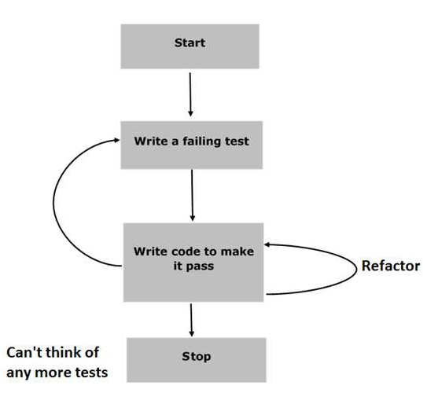

# FEEDREADER PROJECT
Testing is an important prerequisite for development of properly functional programming products; from good websites to systems software and applications and hence it must be included every time one is doing development. Tests help to make the development projects maintain their properties and be authentic. This is refered to as **Test Driven Development (TDD)**.
## JASMINE TESTING FRAMEWORK
Jasmine testing framework is an open source JavaScript framework that can be run on any JavaScript platform for testing JavaScript code. It is clean, has obvious syntax, is behavior driven and does not depend on any another framework.
An illustration of the **Behavior Driven Development** nature of Jasmine is as shown. 

This image was obtained  from [Tutorials Point](https://www.tutorialspoint.com/jasminejs/jasminejs_bdd_architecture.htm)

### 1. Set up Jasmine Framework
Here, Jasmine framework is prepared. The setup may be downloaded from [here](https://jasmine.github.io/)
### 2. Begin writing the tests
The test is then written but it will fail because the JavaScript code is yet to be written.
### 3. Write the JavaScript code
The JavaScript code will then be written and it has to pass all the test specifications of the Jasmine test.
### 4. The refactoring
In this phase, as many tests as the developer needs are written for the application to work well and the subsequent JavaScript code.
### 5. Finish
Once all the tests have been written and have passed, the application is ready for deployment. The full cycle of test driven development would have been completed.

## About the project
This is a web-based application that reads RSS feeds. I used Jasmine to write a number of tests against the application. These were ment to test the underlying business logic of the application as well as the event handling and DOM manipulation.

The advantages of **TDD** include:
1. Creates clean code.
2. It becomes easier to debug for error.
3. Creates a solid code
4. High quality code is created
5. Shortens development time
6. It makes it easier to make changes to already developed applications much later

## Steps of Development
### 1. Looping through the feeds
```
 describe('RSS Feeds', function() {
      
        it('are defined', function() {
            expect(allFeeds).toBeDefined();
            expect(allFeeds.length).not.toBe(0);
        });

        it('has all the URL defined', function(){
            for(const item of allFeeds){
                expect(item.url).toBeDefined();
                expect(item.url.length).not.toBe(0);
            }
        });

        it('has all the names defined', function(){
            for(const item of allFeeds){
                expect(item.name).toBeDefined();
                expect(item.name.length).not.toBe(0);
            }
        });

```
Our first test allows us to loop through the array having all the feeds; both the names and the URL's and ensure that they are all defined. The first spec is to **describe the RSS feeds** then followed by the **test statement**. The **expect** and **toBe** methods the expected test result.

### 2. Testing the MENU
```
 describe('The menu', function(){
        it('is hidden by default',function(){
            let menuTab = document.querySelector('body');
            
            expect(menuTab.classList.contains('menu-hidden')).toBe(true);
        });
     
         it('comes on and off on click of the menu icon', function(){
            let menuTab = document.querySelector('body');
            let menuIcon = document.querySelector('.menu-icon-link');

            menuIcon.click();
            expect(menuTab.classList.contains('menu-hidden')).toBe(false);
            menuIcon.click();
            expect(menuTab.classList.contains('menu-hidden')).toBe(true);
         });
    });
```
This tests ensures the menu tab can be toggled on and off by clicking on the menu icon and that it is hidden by default on loading the page.

### 3. Initial Entries
```
describe('Initial Entries', function(){
        beforeEach(function(done){
            loadFeed(0, done);
        });
        it('it finishes its work', function(){
            const feeder = document.querySelector('.feed');
            expect(feeder.children.length > 0).toBe(true);
        });
    });
     
        describe('New Feed Selection', function(){
            const feeder = document.querySelector('.feed');
            const initialFeeder = [];
                beforeEach(function(done){
                    loadFeed(0);
                    Array.from(feeder.children).forEach(function(entry){
                        initialFeeder.push(entry.innerText);
                    });
                    loadFeed(1, done);
                });
                
                it('alters the state of the content', function(){
                    Array.from(feeder.children).forEach(function(entry,index){
                        expect(entry.innerText !== initialFeeder[index]).toBe(true);
                });
            });
            
        });
        
```
I called the `loadFeed` function and after it “completes” it’s work, we check that the feed container contains at least a single entry element. This is known as **asynchronous js loading** where by **_a function is loaded to completion before the other tasks continue_**.
We use Jasmine’s `beforeEach` method which means that everything we include in this function will run before our `expect` test statement.
I then **_described_** the `New feed selection` spec that ensures changing of content when a new feed is loaded.

# Conclusion
This project shows how important Test Driven Development is and should be used whenever one is building something.

# Hosting
The project has been hosted [HERE](https://wekesa931.github.io/FEED_READER_TESTING/).